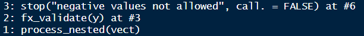
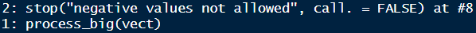

```{r}
#| include: false

library(tidyverse)
library(tictoc)

theme_set(theme_minimal(20))

update_geom_defaults("point", list(size = 3))
```

# Writing Functions & <br> Lab 3

**Week 7**

## Agenda {.smaller}

* What makes functions "good"
* Building up functions
* Non-standard evaluation

**Learning objectives**

* Understand how functions build on top of each other and why "only do one thing" is a good mantra
* Understand non-standard evaluation is, even if you aren't able to fully work with it

## Brainstorm

What makes a function "good" or "bad"

`r countdown::countdown(minutes = 2)`

## {visibility="hidden"}


::: aside
Master `R` training
:::

## {visibility="hidden"}


::: aside
Master `R` training
:::

## Function output {visibility="hidden"}

{width=40%}

::: aside
Wickham. Master `R`.
:::

## Function Advice

::: {.incremental}
* Your function should do ONE thing and do it well
* Embed useful error messages and warnings
  	+ Particularly if you're working on a package or set of functions or others are using your functions
  	+ Right answer > Helpful error > Unhelpful error > Wrong answer
* Careful when naming functions - be as clear as possible
* Refactor your code to be more clear after initial drafts (it's okay to be messy on a first draft)

:::

## Refactoring Code {.smaller}

Improving the internal structure of your code to make it more readable, maintainable, and efficient, without changing its external behavior

- Make existing code 
    + more readable
    + more maintainable
    + more modular
    + better performing
    + more efficient
- Maintain functionality

. . .

Breaking a function down into smaller functions 

## Remember this from last week? {.smaller}

How can we break this function into smaller functions? 

Brainstorm with your neighbor

```{r clean-up1}
both_na <- function(x, y) {
	if(length(x) != length(y)) {
		lx <- length(x)
		ly <- length(y)
		
		v_lngths <- paste0("x = ", lx, ", y = ", ly)

		if(lx %% ly == 0 | ly %% lx == 0) {
			warning("Vectors were recycled (", v_lngths, ")")
		}
		else {
			stop("Vectors are of different lengths and are not recyclable:",
			     v_lngths)	
		}
	}
	sum(is.na(x) & is.na(y))
}

```

`r countdown::countdown(2, top = 0)`

## Calculate if recyclable

```{r recyclable}
recyclable <- function(x, y) {
	test1 <- length(x) %% length(y)
	test2 <- length(y) %% length(x)

	any(c(test1, test2) == 0)
}
```

## Test it

```{r recyclable-test}
a <- c(1, NA, NA, 3, 3, 9, NA)
b <- c(NA, 3, NA, 4, NA, NA, NA)
```

. . .

```{r}
recyclable(a, b)
```

. . .

```{r}
recyclable(a, c(b, b))
```

. . .

```{r}
recyclable(a, c(b, b, b))
```

. . .

```{r}
recyclable(c(a, a), c(b, b, b))
```

## Revision {.smaller}

:::: {.columns}
::: {.column width="50%"}

```{r}
both_na <- function(x, y) {
	if(length(x) != length(y)) {
		lx <- length(x)
		ly <- length(y)
		
		v_lngths <- paste0("x = ", lx, ", y = ", ly)

		if(lx %% ly == 0 | ly %% lx == 0) {
			warning("Vectors were recycled (", v_lngths, ")")
		}
		else {
			stop("Vectors are of different lengths and are not recyclable:",
			     v_lngths)	
		}
	}
	sum(is.na(x) & is.na(y))
}
```

:::

::: {.column width="50%"}

```{r both_na-rev1}
#| code-line-numbers: "|3,16|3-10|12-14|16-23"
both_na <- function(x, y) {

	if(!recyclable(x, y)) {
		stop(
		  "Vectors are of different lengths and are not recyclable:\n",
		  "x = ", length(x), "\n",
		  "y = ", length(y),
		  call. = FALSE
	  )	
	}

	if(length(x) == length(y)) {
		return(sum(is.na(x) & is.na(y)))
	}
	
	if(recyclable(x, y)) {
		warning(
		  "Vectors were recycled\n", 
		  "x = ", length(x), "\n",
		  "y = ", length(y),
		  call. = FALSE
	  )
	}
  sum(is.na(x) & is.na(y))
}
```

:::

::::

## Test it

```{r both_na-rev1-test}
#| error: true
#| warning: true
both_na(a, b)
```

. . .

```{r both_na-rev1-test2}
#| error: true
#| warning: true
both_na(a, c(b, b))
```

. . .

```{r}
#| error: true
#| warning: true
both_na(c(a, a), b)
```

. . .

```{r}
#| error: true
#| warning: true
both_na(c(a, b), c(b, b, b))
```


## Anything else? {.smaller}

. . .

Make errors/warnings a function

. . .

Note this function uses the `recylable()` function we created previously

```{r check-lengths}
#| code-line-numbers: "|3|2|3-10|3,11|11-18"

check_lengths <- function(x, y) {
	if(length(x) != length(y)) {
		if(recyclable(x, y)) {
		  warning(
  		  "Vectors were recycled\n", 
  		  "x = ", length(x), "\n",
  		  "y = ", length(y),
		    call. = FALSE
		  )
		}
		else {
		  stop(
		    "Vectors are of different lengths and are not recyclable:\n",
		    "x = ", length(x), "\n",
		    "y = ", length(y),
		    call. = FALSE
		  )	
		}
	}
}
```


## Revision 2

Note  `check_lengths()` contains `recyclable()`

```{r rev2}
#| code-line-numbers: "|2"
both_na <- function(x, y) {
	check_lengths(x, y)
	sum(is.na(x) & is.na(y))
}
```


## Test it

```{r}
#| error: true
#| warning: true
both_na(a, b)
```

. . .

```{r}
#| error: true
#| warning: true
both_na(a, c(b, b))
```

. . .

```{r}
#| error: true
#| warning: true
both_na(c(a, a), b)
```

. . .

```{r}
#| error: true
#| warning: true
both_na(c(a, b), c(b, b, b))
```

## Why would we do this?

* In this case - more readable code
* We might re-use the `recyclable()` or `check_lengths()` functions in other/new functions
* Helps make de-bugging easier

## Quick de-bugging example {.smaller}

:::: {.columns}
::: {.column width="50%" .fragment}

Nested functions

```{r}
fx_clean <- function(x) {
  as.numeric(str_trim(as.character(x)))
}

fx_validate <- function(y) {
  if (any(is.na(y))){ 
    stop("NAs produced after coercion", call. = FALSE)
  }
  if (any(y < 0)) {
    stop("negative values not allowed", call. = FALSE)
  }
  y
}

fx_transform  <- function(z) { 
  z <- log(z); z[!is.infinite(z)] 
  }

fx_summarize  <- function(t) {
  mean(t) + 10
}

process_nested <- function(x) {
  y <- fx_clean(x)
  z <- fx_validate(y)
  t <- fx_transform(z)
  fx_summarize(t)
}
```

:::

::: {.column width="50%" .fragment}

One big function

```{r}
process_big <- function(x) {
  # clean
  x <- str_trim(as.character(x))
  y <- as.numeric(x)
  
  # validate
  if (any(is.na(y))) {
    stop("NAs produced after coercion", call. = FALSE)
  }
  if (any(y < 0)) {
    stop("negative values not allowed", call. = FALSE)
  }
  
  # transform
  z <- log(y)
  t <- z[!is.infinite(z)]
  
  # summarize
  mean(t) + 10
}
```

:::

::::

## `traceback()`

```{r}
vect <- c(1, 2, -3, 4)
```

. . .

:::: {.columns}
::: {.column width="50%" .fragment}

Nested functions

```{r}
#| eval: false
process_nested(vect)
traceback()
```



:::

::: {.column width="50%" .fragment}

One big function

```{r}
#| eval: false
process_big(vect)
traceback()
```




:::

::::


## Quick de-bugging example {visibility="hidden"}

```{r nested-funs}
f <- function(a) g(a)
g <- function(b) h(b)
h <- function(c) i(c)
i <- function(d) {
  if (!is.numeric(d)) {
    stop("`d` must be numeric", call. = FALSE)
  }
  d + 10
}
```

## traceback {visibility="hidden"}

```{r err-traceback}
#| error: true
f("a")
```

. . .

```{r}
#| eval: false
traceback()
```


# Non-standard evaluation (NSE)

A high-level look

## Note

* Were it not for the `{tidyverse}`, we would'nt cover NSE
* Generally, it's not an incredibly important topic
* But, NSE is ubiquitous in the `{tidyverse}` - literally just about everything uses NSE, which makes programming with `{tidyverse}` functions more difficult

## What is NSE {.smaller}

* Implementation of different scoping rules
* In `{dplyr}` and many others, arguments are evaluated inside the specified **data frames**, rather than the current or global **environment**

. . .

**How?**

1. Capture an expression (**quote it**)
2. Use the expression within the correct context (**evaluate it**)

For example: 

`x` is evaluated as `df$x` rather than `globalenv()$x`

## Example {.smaller}

Using the `percentile_df()` function we created last week

::: {.panel-tabset}

## Last week

We used `arg$x`

```{r}
#| output-location: fragment
#| code-line-numbers: "|2,5"
percentile_df <- function(x) {
	arg <- as.list(match.call()) # returns a list of the arguments
	x <- sort(x)
	d <- data.frame(value = x, percentile = ecdf(x)(x))
	names(d)[1] <- paste0(as.character(arg$x), collapse = "_") # names first column after the argument
	d
}
percentile_df(rnorm(100, 5, 0.2)) |>
	head()
```


## Updated

Here `base::substitute()`

```{r nse-percentile_df}
#| output-location: fragment
#| code-line-numbers: "|4"
percentile_df <- function(x) {
	sorted <- sort(x)
	d <- data.frame(sorted, percentile = ecdf(sorted)(sorted))
	names(d)[1] <- paste0(substitute(x), collapse = "_")
	d
}
percentile_df(rnorm(100, 5, 0.2)) |>
	head()
```

:::

## What does `substitute()` do?

* Outside of a function 
    + operates just like `quote()` - it quotes the input
* Inside of a function
    + does as its name implies - it substitutes the input for the name

## Example

Outside of a function

```{r }
#| output-location: fragment
quote(subset(df, select = var))
```

```{r }
#| output-location: fragment
substitute(subset(df, select = var))
```

. . .

Inside of a function

```{r }
#| output-location: fragment
extract_var <- function(df, var) {
	substitute(df)
}
extract_var(mtcars)
```

. . .

substitutes the input for the name

## Getting `extract_var()` to work {.smaller}

:::: {.columns}
::: {.column width="50%" .fragment}
```{r substitute-success1}
#| output-location: fragment
extract_var <- function(df, var) {
	subset(eval(substitute(df)), 
	       select = var)
}
extract_var(mtcars, "mpg")
```

:::

::: {.column width="50%" .fragment}

Why `eval()`?

::: {.incremental}
* `substitute()` is quoting the input, but we then need to `eval`uate it
* All of this is ~~a little~~ confusing, Joe!
* Well `{tidyverse}` uses this so frequently, they've implemented their own version
    + `tidyeval`, which we'll get to in a minute

:::

:::

::::


## Better {.smaller}

Use NSE for both arguments

Wrap `eval()` around both the `df` and the `var`

```{r substitute-success2}
#| output-location: fragment
extract_var <- function(df, var) {
	eval(substitute(var), envir = df)
}
extract_var(mtcars, mpg)
```

. . .

* The above is equivalent to `df$var` but where both `df` and `var` can be swapped programmatically
* The `var` argument is being **substituted** in for whatever the user supplies, and is being **evaluated** within the `df` *environment*

## Maybe more simply {.smaller}

```{r substitute-success3}
#| output-location: fragment
extract_var <- function(df, var) {
	df[, as.character(substitute(var))]
}
extract_var(mtcars, mpg)
```

. . .

* Why `as.character()`? 
    + `substitute(var)` won't return the string "`mpg`", it returns the name
    + it will try to evaluate the name by looking for an object called "`mpg`" in your environment

## Taking this even further {.smaller}

```{r extract_vars}
extract_vars <- function(df, ...) {
  vars <- substitute(alist(...))
  df[, as.character(vars)[-1]]
}
extract_vars(mtcars, mpg, cyl, disp) |> head()
```

. . .

* We've now basically replicated `dplyr::select()`
* Notice the use of `[-1]`, because calling `as.character()` on `vars` always returns `alist` as the first element in the vector

## Why is NSE used so frequently in the `{tidyverse}`? {.smaller}

:::: {.columns}
::: {.column width="50%" .fragment}

Without NSE you'd write

```{r}
mpg[mpg$cyl == 6, c("cty", "hwy")]
```

:::

::: {.column width="50%" .fragment}

With NSE and `{dplyr}`, you write

```{r}
mpg |> 
  filter(cyl == 6) |> 
  select(cty, hwy)
```

:::

::::

. . .

- `cyl`, `cty`, and `hwy` are not objects in your environment — they're column names
- NSE lets `filter()` and `select()` capture those names and look them up inside the data frame

## Interactive work!

::: {.incremental}
* It makes interactive work easier!
* **But** it make programming with these functions harder...
* Without NSE, `select()` and similar functions would not know where `cyl`, `cty`, and `hwy` "live"
* It would be looking for objects in the global environment with these names

:::

## `{dplyr}` programming fail

::: {.incremental}
* Let's say we wanted a function that returned means in a nice table-like format for a variable by two groups (cross-tab sort of format)
* Typically, we would start by solving this problem for a single situation, then we'd generalize it to a function
* Let's try it!

:::


## `{dplyr}` programming fail

Try generalizing the code below into a function

```{r group-means-practice}
mtcars |>
  group_by(cyl, gear) |>
  summarize(mean = mean(mpg, na.rm = TRUE)) |>
  pivot_wider(
    names_from = cyl, 
    values_from = mean
  )
```

`r countdown::countdown(4)`

## Generalize to a function

Typically, we would expect something like this to work

. . .

```{r }
#| code-line-numbers: "|2|3|4|6"
group_means <- function(data, group_1, group_2, outcome) {
  data |>
    group_by(group_1, group_2) |>
    summarize(mean = mean(outcome, na.rm = TRUE)) |>
    pivot_wider(
      names_from = group_1, 
      values_from = mean)
}
```

## But it doesn't work

```{r group_means-fail}
#| error: true
group_means(mtcars, mpg, cyl, gear)
group_means(diamonds, price, cut, clarity)
```

## Why?

It's looking for objects called `group_1` and `group_2` that don't exist inside the function or in the global workspace!

. . .

**Solution**

tidyeval!

## Tidy evaluation (`{rlang}`)

- `{tidyverse}` doesn't use `substitute()` and `eval()` directly
- `{tidyverse}` has its own system called tidyeval, built in the `{rlang}` package
- tidyeval captures an expression **AND** the environment it came from, so it evaluates correctly even when passed in functions

. . .

embrace the `{{}}` curly-curly operator 

## The `{rlang}` version {visibility="hidden"}

```{r rlang}
group_means <- function(data, outcome, group_1, group_2) {
	out <- enquo(outcome) # Quote the inputs
	g1 <- enquo(group_1)
	g2 <- enquo(group_2)

	data |>
		group_by(!!g1, !!g2) |> # !! to evaluate (bang-bang)
		summarize(mean = mean(!!out, na.rm = TRUE)) |>
		pivot_wider(names_from = !!g1, values_from = mean)
}
```

## The `{rlang}` version {visibility="hidden"}


```{r group_means-success}
group_means(mtcars, mpg, cyl, gear)
group_means(diamonds, price, cut, clarity)
```

## Alternative: Pass the dots {visibility="hidden"}

* Note, I've made the function a bit simpler here by removing the call to `pivot_wider()`

```{r pass-dots}
group_means2 <- function(data, outcome, ...) {
	out <- enquo(outcome) # Still have to quote the outcome

	data |>
		group_by(...) |> 
		summarize(mean = mean(!!out, na.rm = TRUE)) 
}

group_means2(mtcars, mpg, cyl, gear)
group_means2(diamonds, price, cut, clarity)
```

## Added benefit {visibility="hidden"}

I can now also pass as many columns as I want, and it will still work!

```{r pass-dots2}
group_means2(diamonds, price, cut, clarity, color)
```

## Wait a minute! {visibility="hidden"}

This isn't the same thing

!!!! NOTE - WHY NOT?!
. . .

So in this case passing the dots won't fully fix our problem, but there **IS** another alternative

## Curly-curly

```{r double-curly-syntax}
#| code-line-numbers: "|2|3|4|6|10"
#| output-location: fragment
group_means3 <- function(data, group_1, group_2, outcome) {
	  data |>
		    group_by({{group_1}}, {{group_2}}) |> 
		    summarize(mean = mean({{outcome}}, na.rm = TRUE)) |>
		    pivot_wider(
		      names_from = {{group_1}}, 
		      values_from = mean)
}

group_means3(mtcars, cyl, gear, mpg)
```

## Pipe-centric

Because the `data` argument comes first, this function works just like any other in the `tidyverse`

```{r pipe-centric-example}
#| output-location: fragment
#| code-line-numbers: "|1|2|3|4"
diamonds |> 
  filter(color == "E") |> 
  select(carat, cut, clarity) |> 
  group_means3(cut, clarity, carat)
```

## Note

* `{{}}` syntax gets you out of tidyeval complications most of the time
* If you start doing a lot of programming with the `{tidyverse}`, you'll probably want to read up more on [tidyeval](https://ggplot2.tidyverse.org/reference/tidyeval.html) and get comfy with quoting/unquoting

## Pass the dots!

- If you have a specific variable that is used in an expression use `{{{var}}}`
- But if you have multiple variables being passed through untouched, then pass the dots and use `...`

## Specific variable `{{}}`

For example:

`filter()` needs to know what the specific `col` is

```{r}
my_filter <- function(df, col) {
  dplyr::filter(df, {{col}} > 10)   
}
```

## Passing variables through with `...`

Say we want to write a function that summarizes selected columns of a data frame by returning:

+ mean 
+ standard deviation
+ min
+ max 

. . . 

Of course we would solve on an example case first, then generalize to a function

## Try it out {.smaller}

Want to try it on your own? 

1. Start with the `diamonds` data
2. Select few columns
3. Return a df like this:

```{r}
#| echo: false
diamonds |> 
  select(carat, depth, price) |> 
  pivot_longer(
    cols = everything(), 
    names_to = "var", 
    values_to = "val"
  ) |>
	group_by(var) |>
	summarize(
	  mean = mean(val, na.rm = TRUE),
	  sd = sd(val, na.rm = TRUE),
	  min = min(val, na.rm = TRUE),
	  max = max(val, na.rm = TRUE)
	 )
```

## Try it out {.smaller}

Want to try it on your own? 

. . . 

```{r}
diamonds |> 
  select(carat, depth, price) |> 
  pivot_longer(
    cols = everything(), 
    names_to = "var", 
    values_to = "val"
  ) |>
	group_by(var) |>
	summarize(
	  mean = mean(val, na.rm = TRUE),
	  sd = sd(val, na.rm = TRUE),
	  min = min(val, na.rm = TRUE),
	  max = max(val, na.rm = TRUE)
	 )
```

## Pass the dots! {.smaller}

```{r}
#| code-line-numbers: "|1|3"
summarize_cols <- function(data, ...) {
	data |>
		select(...) |>
		pivot_longer(
		  cols = everything(), 
		  names_to = "var", 
		  values_to = "val"
		) |>
		group_by(var) |>
		summarize(
		  mean = mean(val, na.rm = TRUE),
	    sd = sd(val, na.rm = TRUE),
	    min = min(val, na.rm = TRUE),
	    max = max(val, na.rm = TRUE)
		)
}
```

. . .

```{r summarize_cols-example1}
summarize_cols(diamonds, depth, table, price)
```


## Pipe-centric again

Just putting data as the first argument leads to a lot of benefits

```{r smry-cols}
#| output-location: fragment
#| code-line-numbers: "|2|3|4"
library(palmerpenguins)
penguins |> 
  select_if(is.numeric) |> 
  summarize_cols(everything())
```

## Example with plotting

Linearity

- We want to look and see if an x/y relation is linear
- Function should show linear and non-linear relations
- Optionally show the data

## Maybe this? {.smaller}

```{r scatter-fun-fail}
#| code-line-numbers: "|1|3|5-7|9-12|13-17|18"

check_linear <- function(data, x, y, points = FALSE, se = TRUE) {
  
  p <- ggplot(data, aes(x, y))

  if(isTRUE(points)) {
    p <- p + geom_point(color = "gray80")
  }
  
  if(isTRUE(se)) {
  	p <- p +
  	  geom_smooth(method = "lm") +
  	  geom_smooth() 
  } else {
  	p <- p +
  	  geom_smooth(method = "lm", se = FALSE) +
  	  geom_smooth(se = FALSE)	
  }
  p
}
```

## Nope

```{r}
#| error: true
check_linear(penguins, bill_length_mm, bill_depth_mm)
```

## This

- Use tidyeval
- Also could pass the dots for `se = ` to make it more concise

```{r scatter-fun-success3}
#| code-line-numbers: "|1|3|5|12-13"
check_linear <- function(data, x, y, points = FALSE, ...) {
	
  p <- ggplot(data, aes({{x}}, {{y}})) 
	
  if (points) {
	  p <- p + geom_point(color = "gray80")
	}   
	
  p + 
	  geom_smooth(method = "lm",
		            color = "magenta", 
			          ...) +
	  geom_smooth(...)
}
```

## Default

```{r scatter-tidyeval}
check_linear(penguins, bill_length_mm, bill_depth_mm)
```

## Add points

```{r }
check_linear(penguins, bill_length_mm, bill_depth_mm,
             points = TRUE)
```

## Add any `ggplot()` functions

```{r ggplot-extend}

check_linear(mtcars, disp, mpg, se = FALSE) +
	labs(title = "Checking linearity",
	     subtitle = "Linear vs LOESS fits",
	     x = "Engine Displacement",
	     y = "Miles Per gallon") +
	theme_dark(22)
```

## Building up plots

* Let's create a function that calculates means and standard errors for every numeric column in a data frame
* We'll then use this function to create a plotting function

## Means and *SE*'s

* First figure it out for a single example
* Note there's not built-in function for the standard error of the mean, which is $\frac{\sigma}{\sqrt{n}}$

. . .

```{r label, options}
# SE function
se <- function(x) {
  x <- x[!is.na(x)] # remove missing data
  sd(x) / sqrt(length(x))
}
```

## Full means and *SE*s

Very similar to our `summarize_cols()` function

```{r mtcars-mean-se-ex}
#| output-location: fragment
penguins |> 
  select_if(is.numeric) |> 
  pivot_longer(everything(),
               names_to = "var",
               values_to = "val") |> 
  group_by(var) |> 
  summarize(
    mean = mean(val, na.rm = TRUE),
    se = se(val)
  )
```

## Challenge

Try to generalize the code on the previous slide into a  function

Test it on the `forcats::gss_cat` data

`r countdown::countdown(3)`

## Translate to a function

. . .

```{r mean-se-fun}
estimate_means <- function(df) {
  df |>
    select_if(is.numeric) |> 
    pivot_longer(everything(),
                 names_to = "var",
                 values_to = "val") |> 
    group_by(var) |> 
    summarize(mean = mean(val, na.rm = TRUE),
              se = se(val))
}
estimate_means(forcats::gss_cat)
```

## Plot {.smaller}

```{r fig.height = 5}
#| code-line-numbers: "1|1:8"
#| output-location: fragment
estimate_means(airquality) |> 
  ggplot(aes(mean, var)) +
    geom_point() +
    geom_linerange(
        aes(xmin = mean + (qnorm(0.025) * se),
            xmax = mean + (qnorm(0.975) * se)),
        color = "magenta",
    )
```

## Create plot function

Notice we've successfully avoided tideval entirely in both examples!

```{r plot-means}
#| code-line-numbers: "|2|"
plot_means <- function(df) {
  means <- estimate_means(df) |>
    mutate(var = reorder(factor(var), mean))
  
  ggplot(means, aes(mean, var)) +
    geom_point() +
    geom_linerange(
      aes(xmin = mean + (qnorm(0.025) * se),
          xmax = mean + (qnorm(0.975) * se)),
      color = "magenta",
    )
}
```

## Examples

```{r plot-means-ex1}
plot_means(penguins)
```

## Examples

```{r plot-means-ex2}
plot_means(diamonds)
```

## Overall takeaway

* Non-standard evaluation is confusing but kind of neat
* Programming with the `{tidyverse}` can be a bit more difficult, but not always
    + use the `{{}}`
* Good to think about multiple ways to approach the same problem (and when programming, perhaps think outside the `{tidyverse}` at times)

# Lab 3


